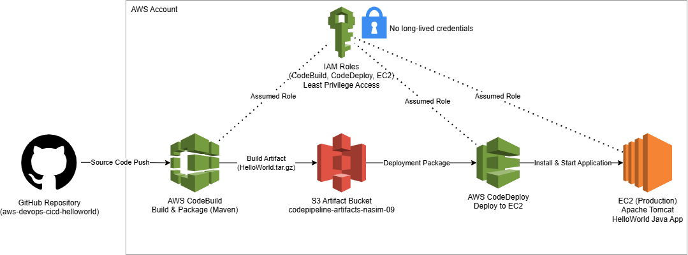

# AWS DevOps CI/CD — HelloWorld  
**GitHub → CodeBuild → S3 → CodeDeploy → EC2 (Tomcat)**

---

## Project Overview

This project demonstrates a **production-style CI/CD pipeline on AWS** using a Java HelloWorld application.  
Source code is stored in GitHub, automatically built with AWS CodeBuild, packaged as an artifact in Amazon S3, and deployed to a production EC2 instance using AWS CodeDeploy.

The goal of this project was not just to deploy an application, but to **understand and implement real DevOps workflows**, including IAM security, artifact handling, deployment automation, troubleshooting, and cost management.

---

## Architecture Overview



**Flow:**
GitHub
→ CodeBuild (Maven build)
→ S3 (artifact storage)
→ CodeDeploy
→ EC2 (Tomcat – production)


### Key Design Notes
- IAM roles are used everywhere (no long-lived credentials on servers)
- Build artifacts are versioned and stored centrally in S3
- Deployment is automated and repeatable
- Infrastructure is terminated after completion to avoid cost

---

##  Technologies Used

### AWS
- Amazon EC2 (Ubuntu 22.04, Tomcat 9)
- AWS CodeBuild
- AWS CodeDeploy
- Amazon S3
- AWS IAM
- Amazon CloudWatch Logs

### Application
- Java
- Maven
- Apache Tomcat 9

### DevOps & Tools
- GitHub (SSH authentication)
- AWS CLI
- Linux (Ubuntu)
- draw.io (architecture diagram)

---

## What This Project Demonstrates

- Secure GitHub access from EC2 using SSH keys
- CI build automation with Maven in CodeBuild
- Artifact packaging and storage in S3
- Automated application deployment using CodeDeploy
- Linux server provisioning and service management
- Troubleshooting real-world DevOps issues
- Clean GitHub repository organization
- Cost-aware cloud cleanup

---

## Proof of Success

### - Live Application
The application was successfully deployed and verified via browser: http://34.238.43.168:8080/


### - Build Artifact

s3://codepipeline-artifacts-nasim-09/helloworld-build/HelloWorld.tar.gz


### - Visual Proof
See `screenshots/_highlights/` for:
- CodeBuild success
- CodeDeploy success
- Live application in browser

---

## Issues Encountered & How I Fixed Them

### 1️. GitHub SSH Authentication Failed on Windows
**Problem:**  
`Permission denied (publickey)` when pulling from GitHub on Windows.

**Cause:**  
SSH keys were configured on EC2, not on Windows.

**Fix:**  
Cloned the repository using **HTTPS** on Windows for editing, while keeping **SSH authentication** on EC2 for CI/CD.

---

### 2️. Repository Pointed to AWS CodeCommit Instead of GitHub
**Problem:**  
Initial repository remote was still set to CodeCommit.

**Fix:**  
Removed the CodeCommit remote and added GitHub as the new origin:

```bash
git remote remove origin
git remote add origin git@github.com:nasimbayati/aws-devops-cicd-helloworld.git
```
### 3️. macOS Metadata Files Polluted the Repo
**Problem:**  
Files like `.DS_Store` and `._*` appeared after extracting the provided codebase.

**Cause:**  
The archive was created/extracted on macOS at some point, which can embed extra metadata (Apple xattrs / resource fork files).

**Fix:**  
Removed the metadata files and added a strong `.gitignore` to prevent future issues.

```bash
# Find and remove common macOS metadata files
find . -name ".DS_Store" -delete
find . -name "._*" -delete
```

### 4. Screenshots Were Only on Local Machine

**Problem:**  
All screenshots were initially stored only on the local Windows machine and were not present in the GitHub repository.

**Fix:** 
Used scp to upload screenshots from Windows to the EC2 development instance, then committed and pushed them properly to GitHub.

```bash
scp -i github_rsa -r screenshots/ ubuntu@<EC2_PUBLIC_IP>:/opt/aws-devops-cicd-helloworld/screenshots/
```

### 5. Windows Folder Locked / Access Denied

**Problem:** 
Windows would not allow renaming an existing project folder.

**Cause:**  
OneDrive synchronization and Windows file-system permission locking.

**Fix:** 
Instead of forcing a rename, the repository was cloned into a new folder name, avoiding permission conflicts and allowing clean Git operations.

---

## Security Considerations

- IAM roles used instead of long-lived access keys
- No credentials stored in code or on disk
- Public access restricted where possible
- SSH access limited to key-based authentication only

## Cost Management

All AWS resources (EC2, CodeBuild, CodeDeploy, S3) were **terminated after successful deployment** to prevent unnecessary charges.

This project is intended as a **CI/CD demonstration**, not a production workload.

---

## Repository Structure

```text
.
├── architecture/
│   └── architecture-aws-ci-cd-helloworld.png
├── screenshots/
│   ├── _highlights/
│   └── (curated step screenshots)
├── notes/
│   └── lessons-learned.md
├── appspec.yml
├── buildspec.yml
├── pom.xml
└── README.md
```

---

## What I Would Improve in Production

- Add an Application Load Balancer (ALB)
- Enable HTTPS with AWS Certificate Manager (ACM)
- Replace EC2 with ECS or EKS
- Add CodePipeline for full end-to-end automation
- Add automated tests in CodeBuild
- Add monitoring and alerting (CloudWatch alarms)

---

## How to Reproduce (High Level)

1. Push code changes to GitHub
2. CodeBuild automatically builds the application using Maven
3. Build artifact is stored in S3
4. CodeDeploy deploys the artifact to EC2
5. Application is available via Tomcat on port 8080

---

## Final Notes

This project was built step-by-step to fully understand how CI/CD pipelines actually work in AWS — including real-world failures and fixes.

It reflects **practical DevOps skills**, not just following a tutorial.

---

## Author
Nasim Bayati  
DevOps & Cloud Engineering (AWS)